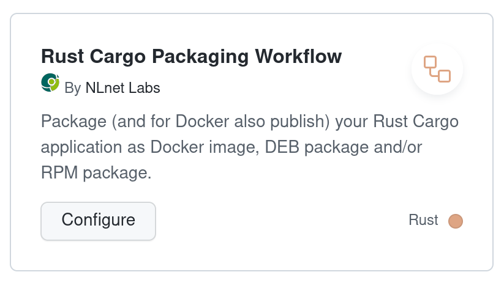

# NLnet Labs reusable & starter workflows

This repository contains a single [reusable workflow](https://docs.github.com/en/actions/using-workflows/reusing-workflows) and associated [starter workflow](https://docs.github.com/en/actions/using-workflows/creating-starter-workflows-for-your-organization) which together can be used to package Rust Cargo  applications as DEB & RPM packages (for manual publication) and as Docker images (automatically published to Docker Hub).

## The Rust Cargo Packaging **starter** workflow

A GitHub [starter workflow](https://docs.github.com/en/actions/using-workflows/creating-starter-workflows-for-your-organization) is an easy way to get started with creating a new GitHub Actions workflow for your GitHub repository.

Starter workflows must be stored in the organization wide repository, i.e. this repository, in a folder called `workflow-templates`. This repository contains one such starter workflow which can be seen when creating a new workflow via the `New Workflow` button on the `Actions` tab of a GitHub repository. If the invoking repository contains a `Cargo.toml` file you should see the following starter workflow amongst the set to choose from:



Clicking `Configure` will drop you in to a web editor with a copy of the `workflow-templates/pkg-rust.yml` file from this repository which you can edit to get started with using the reusable Rust Cargo Packaging workflow. In this case the starter workflow is a minimal workflow showing how to invoke the reusable Rust Cargo Packaging workflow. Read on to learn more about it.

## The Rust Cargo Packaging **reusable** workflow

GitHub Actions workflows are so-called [reusable workflows](https://docs.github.com/en/actions/using-workflows/reusing-workflows) if they contain a `workflow_call` trigger. This trigger enables the workflow to be called from another workflow, i.e. to be re-used.

This repository contains a single reusable workflow in `.github/workflows/pkg-rust.yml` which is referred to by the starter workflow (see above) as the "Rust Cargo Packaging Workflow".

### Workflow inputs

Reusable workflows take a set of inputs which can be used to affect the behaviour of the workflow when run.

The most complex inputs take GitHub workflow matrices as input. Internally GitHub and the workflow work with these as [JSON](https://json.org/) objects and it is possible to construct and pass such JSON matrix objects to the workflow via its inputs (e.g. with the help of the GitHub [`fromJSON`](https://docs.github.com/en/actions/learn-github-actions/expressions#fromjson) and [`toJSON`](https://docs.github.com/en/actions/learn-github-actions/expressions#tojson) functions).

As a more readable and easier alternative the worfklow also supports loading matrices from [YAML](https://yaml.org/) files, i.e. you can express the matrix just as you would [natively in a workflow YAML file](https://docs.github.com/en/actions/using-jobs/using-a-matrix-for-your-jobs) - specifically the YAML content in the file will be used as the value of the `matrix` workflow key.

| Input | Notes |
| --- | --- |
| `cross_build_rules` | A **JSON** array of [Rust target triples](https://doc.rust-lang.org/nightly/rustc/platform-support.html) to cross-compile your application for. Cross compilation takes place inside a Docker container running an image from the Rust [`cross`](https://github.com/cross-rs/cross) project. These images contain the correct toolchain components needed to compile for one of the [supported targets](https://github.com/cross-rs/cross#supported-targets). |
| `package_build_rules` | A GitHub Actions **JSON** matrix definition that specifies which operating systems and versions packages should be created for. Currently only DEB and RPM packages can be created, using either x86_64 binaries compiled on-the-fly, or cross-compiled binaries compiled per the `cross_build_rules`. |
| `package_build_rules_path` | A relative path to a **YAML** file containing the `package_build_rules` matrix. |
| `package_test_rules` | A GitHub Actions **JSON** matrix definition that specifies which operating systems and versions provided test scripts should be run, and whether to run them post-install and/or post-upgrade. |
| `package_test_rules_path` | A relative path to a **YAML** file containing the `package_test_rules` matrix. |
| `docker_build_rules` | A GitHub Actions **JSON** matrix definition that specifies which platforms Docker images should be built for and whether to build the application image inside a Docker container or to copy in a cross-compiled binary that was compiled per the `cross_build_rules`. |
| `docker_build_rules_path` | A relative path to a **YAML** file containing the `docker_build_rules` matrix. |

For now the best way to understand these inputs is to look at the input descriptions in the workflow itself:

- https://github.com/NLnetLabs/.github/blob/main/.github/workflows/pkg-rust.yml#L131

And by looking at one of the places where the workflow is, or will soon be, used:

- https://github.com/NLnetLabs/.github-testing/blob/main/.github/workflows/pkg.yml
- https://github.com/NLnetLabs/rtrtr/blob/main/.github/workflows/pkg.yml
- https://github.com/NLnetLabs/routinator/blob/main/.github/workflows/pkg.yml
- https://github.com/NLnetLabs/krill/blob/main/.github/workflows/pkg.yml

To understand more about the history and design of the workflow read the comments at the top of the workflow itself:

- https://github.com/NLnetLabs/.github/blob/main/.github/workflows/pkg-rust.yml#L1

## Developing the reusable workflow

### Tips

1. The workflow Docker behaviour differs depending on whether the workflow is invoked for a Git release tag ("release" here meaning that the tag is of the form `v*` without a trailing `-*` suffix), a `main` branch or some other branch (e.g. a PR branch). To fully test it you should either run the workflow in each of these cases or modify the workflow behaviour temporarily to be triggered as necessary for testing.

2. When a calling GitHub workflow invokes a GitHub Action or reusable workflow it does so typically by major version number, e.g. <action or workflow>@v2. However, for reusable workflows this isn't actually done via GitHub selecting the nearest match according to semantic versioning rules, instead it is a trick achieved by the action and workflow publishers tagging their repository twice: once with the actual version, e.g. v2.1.3, and once with a major version only tag, e.g. v2, that **both point to the same Git ref**, i.e. the major version tag is deleted and re-created whenever a new minor or patch version tag is created.

3. When you push a change to the `pkg-rust.yml` workflow in this repository, downstream workflows that call `pkg-rust.yml` (e.g. from the https://github.com/NLnetLabs/.github-testing/ repository) will not see the changes unless you either update the `@<git ref>` to match the new commit, or if using `@<tag>` if the tag is moved to the new commit, or if using `@<branch>` you will need to trigger a new run of the action or do "Re-run all jobs" on the workflow run. Doing "Re-run failed jobs" is **NOT ENOUGH** as then GitHub Actions will use the workflow at the exact same commit as it used before, it won't pick up the new commit to the branch.

### Release process
  
To test and release changes to the workflow the recommended approach is as follows: _(an example of this release process in use can be seen [here](https://github.com/NLnetLabs/.github/pull/7#issuecomment-1246370906))_

Let's call this repository the RELEASE repo.
Let's call the https://github.com/NLnetLabs/.gihub-testing/ repostiory the TEST repo.

- [ ] 1. Create a branch in the RELEASE repo, let's call this the RELEASE branch.
- [ ] 2. Create a matching branch in the TEST repo, let's call this the TEST branch.
- [ ] 3. Make the desired changes to the RELEASE branch.
- [ ] 4. In the TEST branch modify `.github/workflows/pkg.yml` so that instead of referring to `pkg-rust.yml@v1` it refers to `pkg-rust.yml@<Git ref of HEAD commit on the TEST branch>` or `pkg-rust.yml@<test branch name>`.
- [ ] 5. Create a PR in the `.gihub-testing` repository from the TEST branch to `main`, let's call this the TEST PR.
- [ ] 6. Repeat steps 3 and 4 until the the `Packaging` workflow run in the TEST PR passes and behaves as desired.
- [ ] 7. Merge the TEST PR to the `main` branch.
- [ ] 8. Verify that the automatically invoked run of the `Packaging` workflow in the TEST repo against the `main` branch passes and behaves as desired. If not, repeat steps 2-7 until the new TEST PR passes and behaves as desired.
- [ ] 9. Create a release tag in the TEST repo with the same release tag as will be used in the RELEASE repo, e.g. v1.2.3. _**Note:** Remember to respect semantic versioning, i.e. if the changes being made are not backward compatible you will need to bump the MAJOR version (in MAJOR.MINOR.PATCH) **and** any workflows that invoke the reusable workflow will need to be **manually edited** to refer to the new MAJOR version._
- [ ] 10. Verify that the automatically invoked run of the `Packaging` workflow in the TEST repo passes against the newly created release tag passes and behaves as desired. If not, delete the release tag **in the TEST repo** and repeat steps 2-9 until the new TEST PR passes and behaves as desired.
- [ ] 11. Merge the RELEASE PR to the `main` branch.
- [ ] 12. Create the new release vX.Y.Z tag in the RELEASE repo.
- [ ] 13. Update the v1 tag in the RELEASE repo to point to the new vX.Y.Z tag.
- [ ] 14. Edit `.github/workflows/pkg.yml` in the `main` branch of the TEST repo to refer again to `@v1`.
- [ ] 15. Verify that the `Packaging` action in the TEST repo against the `main` branch passes and works as desired.
- [ ] 16. (optional) If the MAJOR version was changed, update affected repositories that use the reusable workflow to use the new MAJOR version, including adjusting to any breaking changes introduced by the MAJOR version change.

**How to update the vN tag:**

At the time of writing the GitHub web interface does not offer a way to delete tags or update tags, only to delete the extra "release" details which can be associated with a tag. To update a tag one must do it locally and remotely from the command line.

Assuming that you want to update the v1 tag to point not at the old v1.0.2 tag but at the new v1.0.3 tag, this is one way to do it:
```shell
$ NEW_REF=$(git rev-list -n 1 v1.0.3)
$ git rev-list -n 1 v1
$ git tag --force v1 ${NEW_REF}
$ git rev-list -n 1 v1 # should point to ${NEW_REF} now
$ git push --force --tags
```
