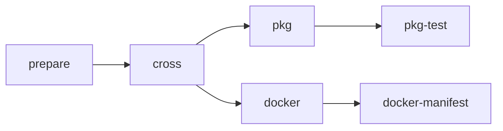

# Ploutos: User guide

In this documentation we'll show you how to invoke the NLnet Labs Rust Cargo Packaging **reusable** workflow (hereafter the "Ploutos workflow") from your own repository and how to create the supporting files needed.

> _**WARNING:** Using Ploutos is free for public GitHub repositories, but is **NOT FREE** for **private GitHub repositories**. As Ploutos runs many jobs in parallel (if configured to build for multiple package types and/or targets) it can consume a LOT of GitHub Actions minutes. If you exceed the [free limits for GitHub private repositories](https://docs.github.com/en/billing/managing-billing-for-github-actions/about-billing-for-github-actions) it will cost money! For example a workflow that ran for ~11 minutes actually used ~141 minutes of GitHub Actions resources in total._

**Contents:**
- [Why use Ploutos?](#why-use-ploutos)
- [Known issues](#known-issues)
- [See also](#see-also)
- [Can I just run the Ploutos workflow?](#can-i-just-run-the-ploutos-workflow)
- [What packages can the Ploutos workflow produce?](#what-packages-can-the-ploutos-workflow-produce)
- [How can I run the created packages?](#how-can-i-run-the-created-packages)
- [How does it work?](#how-does-it-work)
- [How can I use it?](#how-can-i-use-it)
- [Examples](#examples)
- [Key concepts and general configuration](#key-concepts-and-general-configuration)
- [Creating specific package types](#creating-specific-package-types)

## Why use Ploutos?
Ploutos simplifies the creation of Debian, RPM and Docker packages for your Rust projects. You can call it in your project's workflow, by using [Github's reusable workflow feature](https://docs.github.com/en/actions/using-workflows/reusing-workflows). By reusing Ploutus, you can focus on the packaging specifics that matter for your project, instead of duplicating the foundation in every project.

## Known issues

The Ploutos workflow was originally written for use only by NLnet Labs. As such not all behaviours are yet (fully) configurable. With time, sufficient interest and resource permitting these limitations can in principle be removed. For a list of open issues and ideas for improvement and to submit your own see https://github.com/NLnetLabs/.github/issues/.

## See also

- **The starter workflow:** If you already know how to use this workflow but just want to quickly add it to a new project you might find the [starter workflow](../starter_workflow.md) helpful _(**only** visible to NLnet Labs GitHub organization members unfortunately)_.

- **The testing repository:** The https://github.com/NLnetLabs/ploutos-testing/ repository contains test data and workflow invocations for testing Ploutos.

- **The template repository:** The https://github.com/NLnetLabs/ploutos-template/ repository contains a template from which you can create your own repository with sample input files and workflow invocation to get started with the Ploutos workflow.

- **Examples of the workflow in use:** This documentation contains some limited examples but if you're looking for real world examples of how to invoke and configure the Ploutos workflow take a look at the [projects that are already using the Ploutos workflow](https://github.com/NLnetLabs/.github/network/dependents).

## Can I just run the Ploutos workflow?

No, it is not intended to be used standalone. To use it you must call it from your own GitHub Workflow. See the [official GitHub Actions documentation](https://docs.github.com/en/actions/using-workflows/reusing-workflows#calling-a-reusable-workflow) on calling reusable workflows for more information.

## What packages can the Ploutos workflow produce?

The Ploutos workflow is capable of producing Linux (DEB & RPM) packages and Docker images.

Produced DEB and RPM packages will be attached as artifacts to the caller workflow run. **Only GitHub users with `actions:read` permission** will be able to download the artifacts.

> The Ploutos workflow does **NOT** publish DEB and/or RPM packages anywhere. If you want your users to be able to download the produced DEB and/or RPM either directly or from a package repository using a tool like `apt` (for DEB) or `yum` (for RPM) you will need to upload the packages to the appropriate location yourself.

Produced Docker images can optionally be published to [Docker Hub](https://hub.docker.com/). In order for this to work you must configure the destination Docker Hub organisation, repository, username and password/access token and ensure that the used credentials provide write access to the relevant Docker Hub repository.

At NLnet Labs we publish produced DEB and RPM packages at https://packages.nlnetlabs.nl/ via an internal process that downloads the workflow run artifacts and signs & uploads them to the correct location, and Docker images are published by the Ploutos workflow to the appropriate repository under the https://hub.docker.com/r/nlnetlabs/ Docker organisation.

## How can I run the created packages?

Linux packages should be installed using the appropriate package manager (e.g. `apt` for DEB packages and `yum` for RPM packages).

Docker images can be run using the [`docker run`](https://docs.docker.com/engine/reference/commandline/run/) command.

## How does it work?

The Ploutos workflow is a GitHub Actions "reusable workflow" because it [defines](https://github.com/NLnetLabs/ploutos/blob/main/.github/workflows/pkg-rust.yml#L130) the `workflow_call` trigger and the set of inputs that must be provided in order to call the workflow. For an explanation of GitHub reusable workflows see the [official GitHub Actions documentation](https://docs.github.com/en/actions/using-workflows/reusing-workflows) on reusable workflows.

Once called the workflow runs one or more jobs like so:

All of the jobs except `prepare` are matrix jobs, i.e. N instances of the job run in parallel where N is the number of relevant input matrix permutations.

Note that Git checkout is **NOT** done by the caller. Instead Ploutos checks out the source code at multiple different points in the workflow:

- In `prepare` to be able to load rule files from the checked out files.
- In `cross` to have the application files to build available on the GH runner.
- In `pkg` to have the application files to build available in the container.
- In `pkg-test` to have the test script to run available for copying into the LXC container.
- In `docker` to have the `Dockerfile` and Docker context files available for building.

Only the packaging types that you request (via the workflow call parameters) will actually be run, i.e. you can build only DEB packages, or only RPM and Docker, and cross-compile or not as needed.

- `prepare` - checks if the given inputs look roughly okay.
- [`cross`](./cross_compiling.md) - cross-compiles the Rust Cargo application if needed.
- [`pkg`](./os_packaging.md) - compiles (if not already cross-compiled) and packages the Rust Cargo application as a DEB or RPM package.
- [`pkg-test`](./os_packaging.md) - tests the produced DEB/RPM packages, both with some standard checks and optionally with application-specific checks provided by you.
- [`docker`](./docker_packaging.md) - builds and publishes one or more Docker images.
- [`docker-manifest`](./docker_packaging.md) - publishes a combined Docker Manifest that groups architecture specific variants of the same image under a single Docker tag.

The core parts of the workflow are not specific to GitHub but instead just invoke Rust ecosystem tools like [`cargo`](https://doc.rust-lang.org/cargo/), [`cross`](https://github.com/cross-rs/cross), [`cargo-deb`](https://github.com/kornelski/cargo-deb#readme) and [`cargo-generate-rpm`](https://github.com/cat-in-136/cargo-generate-rpm), and setup the correct conditions for invoking those tools, and the testing part invokes tools such as [`lxd` & `lxc`](https://linuxcontainers.org/), `apt` and `yum` which are also not GitHub specific. And of course there are the parts that invoke the `docker` command. The GitHub specific part is the pipeline that ties all these steps together and runs pieces in parallel and passes inputs in and outputs out.

## How can I use it?

1. Decide which package types you want to create.
2. Determine which [inputs](https://github.com/NLnetLabs/ploutos/blob/main/.github/workflows/pkg-rust.yml#L131) you need to provide to the Ploutos workflow.
3. Create the files in your repository that will be referenced by the inputs _(perhaps start from the [template](https://github.com/NLnetLabs/ploutos-template/))_.
4. Call the Ploutos workflow from your own workflow with the chosen inputs _(by hand or via the [starter workflow](/.starter_workflow.md))_.
5. Run your workflow _(e.g. triggered by a push, or use the GitHUb [`workflow_dispatch` manual trigger](https://docs.github.com/en/actions/managing-workflow-runs/manually-running-a-workflow))_.
6. Use the created packages:
   - DEB and RPM packages will be attached as artifacts to the workflow run that you can [download](https://docs.github.com/en/actions/managing-workflow-runs/downloading-workflow-artifacts).
   - Docker images will have been published to Docker Hub.
7. (optional) Publish your DEB and RPM packages to a repository somewhere.

## Examples

- [Simple Docker example](./minimal_docker_example.md)
- [Simple DEB example](./os_packaging.md#example)
- [Real use cases](https://github.com/NLnetLabs/ploutos/network/dependents?dependent_type=REPOSITORY)

## Key concepts and general configuration

Read [this page](./key_concepts_and_config.md) to learn more about key concepts and general configuration not specific to any single packaging type.

## Creating specific package types

To learn more about how to build a particular package type using the Ploutos workflow see:

- [Cross compiling](./cross_compiling.md)
- [Creating O/S packages](./os_packaging.md)
- [Creating Docker images](./docker_packaging.md)
