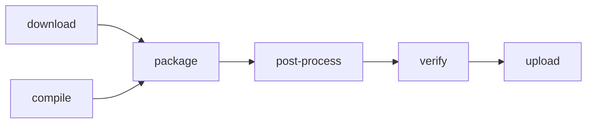
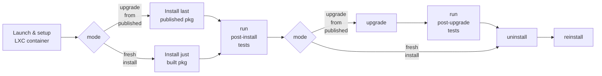

# Ploutos: O/S packaging

**Contents:**
- [Introduction](#introduction)
- [Example](#example)
- [Inputs](#inputs)
  - [Cargo.toml](#cargotoml)
  - [Workflow inputs](#workflow-inputs)
  - [Package build rules](#package-build-rules)
    - [Permitted `<image>` values](#permitted-image-values)
  - [Package test rules](#package-test-rules)
    - [Package test script inputs](#package-test-script-inputs)
- [Outputs](#outputs)
- [How it works](#how-it-works)
  - [Build host pre-installed packages](#build-host-pre-installed-packages)
  - [Install-time package dependencies](#install-time-package-dependencies)
  - [Target-specific and multi-package packaging](#target-specific-and-multi-package-packaging)
  - [Maintainer script(let)s](#maintainer-scriptlets)
  - [Systemd units](#systemd-units)
  - [Automated handling of special cases](#automated-handling-of-special-cases)

## Introduction

The Ploutos workflow can package your Rust Cargo application as one or both of the following common Linux O/S package formats:

| Format | Installers | Example Operating Systems |
|---|---|---|
| [DEB](https://en.wikipedia.org/wiki/Deb_(file_format)) | `apt`, `apt-get` | Debian & derivatives (e.g. Ubuntu) |
| [RPM](https://en.wikipedia.org/wiki/Rpm_(file_format)) | `yum`, `dnf` | RedHat, Fedora, CentOS & derivatives (e.g. Stream, Rocky Linux, Alma Linux) |

The `pkg` and `pkg-test` jobs of the Ploutos workflow package your Rust Cargo application into one or more of these formats, run some sanity checks on them and can verify that they can be installed, ugpraded, uninstalled and can also run tests specific to your application on the installed package.

The set of files to include in the package are defined in `Cargo.toml`. The binaries included are those built by `cargo build --release --locked` (with optional additional arguments defined by you). Other files can be included by adding them to a set of "assets" defined in `Cargo.toml`. Binaries to be included in the package are either pre-compiled by the [`cross` job](./cross_compiling.md) of the Ploutos workflow, or compiled during the `pkg` job, and are stripped of debug symbols before being included.

Packaging and, if needed, compilation, take place inside a Docker container. DEB packaging is handled by the [`cargo-deb` tool](https://crates.io/crates/cargo-deb). RPM packaging is handled by the [`cargo-generate-rpm` tool](https://github.com/cat-in-136/cargo-generate-rpm).

Package testing takes place inside [LXD container instances](https://linuxcontainers.org/lxd/docs/master/explanation/instances/) because, unlike Docker containers, they support systemd and other multi-process scenarios that you may wish to test.

_**Note:** DEB and RPM packages support many different metadata fields and the native DEB and RPM tooling has many capabilities. We support only the limited subset of capabilities that we have thus far needed. If you need something that it is not yet supported please request it by creating an issue at https://github.com/NLnetLabs/.github/issues/, PRs are also welcome!_

## Example

_**Note: This example assumes have a GitHub account, that you are running on Linux, and that Rust, Cargo and git installed.**_

For the packaging process to work we need simple Hello World Cargo project to package, and a bare minimum of package metadata, let's create that and verify that it compiles and runs:

<details>
  <summary>Click here to show the example</summary>

```shell
$ cargo new my_pkg_test
$ cd my_pkg_test
$ cat <<EOF >Cargo.toml
[package]
name = "pkg_hw_test"
version = "0.1.0"
edition = "2021"
authors = ["Example Author"]
EOF
$ cargo run
...
Hello, world!
```

Now let's add a minimal packaging workflow that will package our simple Rust application into a DEB package (because Ubuntu is a DEB based O/S).

```shell
$ mkdir -p .github/workflows
$ cat <<EOF >.github/workflows/pkg.yml
on:
  push:
  
jobs:
  package:
    uses: NLnetLabs/ploutos/.github/workflows/pkg-rust.yml@v5
    with:
      package_build_rules: |
        pkg: mytest
        image: "ubuntu:jammy"
        target: x86_64
```

Assuming that you have just created an empty GitHub repository, let's setup Git to push to it, add & commit the files we have created and push them to GitHub:

```shell
$ git remote add origin git@github.com:<YOUR_GH_USER>/<YOUR_GH_REPO>.git
$ git branch -M main
$ git add .github src/ Cargo.toml Cargo.lock
$ git commit -m "Initial commit."
$ git push -u origin main
```

Now browse to https://github.com/<YOUR_GH_USER>/<YOUR_GH_REPO>/actions and you should see the packaging action running. It will take a few minutes the first time as it is needs to install supporting tooling and then add it to the GH cache for quicker re-use on subsequent invocations.

When finished and successful the Summary page for the completed GitHub Actions run should have an Artifacts section at the bottom listing a single artifact, e.g. something like this:

```
Artifacts
Produced during runtime

Name                              Size
mytest_ubuntu_jammy_x86_64        121 KB
```

The artifact is a zip file that you can download and unzip, and inside is the DEB artifact that you can install, e.g.:

```shell
$ unzip mytest_ubuntu_jammy_x86_64.zip 
Archive:  mytest_ubuntu_jammy_x86_64.zip
   creating: debian/
  inflating: debian/pkg_hw_test_0.1.0-1jammy_amd64.deb 

$ cd debian/

$ apt show ./pkg_hw_test_0.1.0-1jammy_amd64.deb 
Package: pkg_hw_test
Version: 0.1.0-1jammy
Priority: optional
Maintainer: Example Author
Installed-Size: 326 kB
Depends: libc6 (>= 2.34)
Download-Size: 124 kB
APT-Sources: /tmp/pkg_hw_test_0.1.0-1jammy_amd64.deb
Description: [generated from Rust crate pkg_hw_test]

$ sudo apt install ./pkg_hw_test_0.1.0-1jammy_amd64.deb 
Reading package lists... Done
Building dependency tree... Done
Reading state information... Done
Note, selecting 'pkg_hw_test' instead of './pkg_hw_test_0.1.0-1jammy_amd64.deb'
The following NEW packages will be installed:
  pkg_hw_test
0 upgraded, 1 newly installed, 0 to remove and 0 not upgraded.
Need to get 0 B/124 kB of archives.
After this operation, 326 kB of additional disk space will be used.
Get:1 /tmp/pkg_hw_test_0.1.0-1jammy_amd64.deb pkg_hw_test amd64 0.1.0-1jammy [124 kB]
debconf: delaying package configuration, since apt-utils is not installed
Selecting previously unselected package pkg_hw_test.
(Reading database ... 4395 files and directories currently installed.)
Preparing to unpack .../pkg_hw_test_0.1.0-1jammy_amd64.deb ...
Unpacking pkg_hw_test (0.1.0-1jammy) ...
Setting up pkg_hw_test (0.1.0-1jammy) ...

$ pkg_hw_test 
Hello, world!
```

</details>

## Inputs

### Cargo.toml

Many of the settings that affect DEB and RPM packaging are taken from your `Cargo.toml` file by the [`cargo-deb`](https://github.com/kornelski/cargo-deb) and [`cargo-generate-rpm`](https://github.com/cat-in-136/cargo-generate-rpm) tools respectively. For more information read their respective documentation.

Both `cargo-deb` and `cargo-generate-rpm` have a `variant` feature. Ploutos will look for a `cargo-deb` "variant" by the name `<os_name>-<os_rel>[-<target>]` (with target only included in the variant name when cross-compiling, i.e. when `<target>` is not `x86_64`. It also supports the concept of a "minimal" variant, more on that below. `cargo-generate-rpm` variants are not currently supported, except for some limited use internal to Ploutos.

### Workflow inputs

| Input | Type | Required | Description |
|---|---|---|---|
| `package_build_rules` | [matrix](./key_concepts_and_config.md#matrix-rules) | Yes | Defines packages to build and how to build them. See below. |
| `package_test_rules` | [matrix](./key_concepts_and_config.md#matrix-rules) | No | Defines the packages to test and how to test them. Defaults to `package_build_rules`. See below.  |
| `package_test_scripts_path` | string | No | The path to find scripts for running tests. Invoked scripts take a single argument: post-install or post-upgrade. |
| `deb_extra_build_packages` | string | No | A space separated set of additional Debian packages to install in the build host when (not cross) compiling. |
| `deb_apt_key_url` | string | No* | The URL of the public key that can be used to verify a signed package if installing using `deb_apt_source`. Defaults to the NLnet Labs package repository key URL. |
| `deb_apt_source` | string | No* | A line or lines to write to an APT `/etc/apt/sources.list.d/` file, or the relative path to such a file to install. Used when `mode` of `package_test_rules` is `upgrade-from-published`. Defaults to the NLnet Labs package installation settings. |
| `deb_extra_lintian_args` | string | No | A space separated set of additional command line arguments to pass to the Debian Lintian package linting tool. Useful to suppress errors you wish to ignore or to supress warnings when `strict_mode` is set to `true`. |
| `rpm_extra_build_packages` | string | No | A space separated set of additional RPM packages to install in the build host when (not cross) compiling. |
| `rpm_scriptlets_path` | string | No | The path to a TOML file defining one or more of the `pre_install_script`, `pre_uninstall_script`, `post_install_script` and/or `post_uninstall_script` `cargo-generate-rpm` settings. |
| `rpm_yum_key_url` | string | No* | The URL of the public key that can be used to verify a signed package if installing using `rpm_yum_repo`. Defaults to the NLnet Labs package repository key URL. |
| `rpm_yum_source` | string | No* | A line or lines to write to a YUM `/etc/yum.repos.d/` file, or the relative path to such a file to install. Used when `mode` of `package_test_rules` is `upgrade-from-published`. Defaults to the NLnet Labs package installation settings. |

### Package build rules

By supplying `package_build_rules` you instruct Ploutos to package your Rust Cargo application. The process looks like this:



A rules [matrix](./key_concepts_and_config.md#matrix-rules) with the following keys must be provided to guide the build process:

| Matrix Key | Required | Description |
|---|---|---|
| `pkg` | Yes | The package to build. Used in various places. See below. |
| `image` | Yes | Specifies the Docker image used by GitHub Actions to run the job in which your application will be built (when not cross-compiled) and packaged. The package type to build is implied by `<os_name>`, e.g. DEBs for Ubuntu and Debian, RPMs for CentOS Has the form `<os_name>:<os_rel>` (e.g. `ubuntu:jammy`, `debian:buster`, `centos:7`, etc). Also see `os` below.  |
| `target` | Yes | Should be `x86_64` If `x86_64` the Rust application will be compiled using `cargo-deb` (for DEB) or `cargo build` (for RPM) and stripped. Otherwise it will be used to determine the cross-compiled binary GitHub Actions artifact to compile and download. |
| `os` | No | Overrides the value of `image` when determining `os_name` and `os_rel`. |
| `extra_build_args` | No | A space separated set of additional command line arguments to pass to `cargo-deb`/`cargo build`. |
| `rpm_systemd_service_unit_file` | No | Relative path to the systemd file, or files (if it ends with `*`) to inclde in an RPM package. See below for more info. |

**Note:** When `package_test_rules` is not supplied the `package_build_rules` matrix is also used as the `package_test_rules` matrix, since normally you want to test every package that you build. When using `package_build_rules` this way you can also supply `package_test_rules` matrix keys in the `package_build_rules` input. These will be ignored by the package building workflow job.

#### Permitted `<image>` values

The `<image>` **MUST** be one of the following:

- `centos:<os_rel>` where `<os_rel>` is one of: `7` or `8`
- `debian:<os_rel>` where `<os_rel>` is one of: `stretch`, `buster` or `bullseye`
- `ubuntu:<os_rel>` where `<os_rel>` is one of: `xenial`, `bionic`, `focal` or `jammy`

Note the absence of RedHat, Fedora, Rocky Linux, Alma Linux, etc. which are all RPM compatible, and similarly no mention of other Debian derivatives such as Kali Linux or Raspbian.

You can in principle build your package inside an alternate DEB or RPM compatible Docker image by setting `<image>` appropriately to a Docker image that is natively DEB or RPM compatible, e.g `redhat/ubi8`, `fedora:37`, `rockylinux:8` or `kalilinux/kali-rolling`, but then you **MUST** set `<os>` to one of the supported `<image>` values in order to guide the packaging process to produce a DEB or RPM and to take into account known issues with certain releases (especially older ones).

It may not matter which O/S release the RPM or DEB package is built inside, except for example if your build process requires a dependency package that is only available in the package repositories of a particular O/S release, or if one O/S is known to bundle much newer or older versions of a dependency and that could impact your application, or if there is some other variation which matters in your case.

### Package test rules

`package_test_rules` instructs Ploutos to test your packages (beyond the basic verification done post-build).

Only packages that were built using `package_build_rules` can be tested. By default the packages built according to  `package_build_rules` will be tested, minus any packages for which testing is not supported (e.g. missing LXC image or unsupported architecture).

Testing packages is optional. To disable testing of packages completely set `package_test_rules` to `none`.

To test package upgrade you must also supply the `deb_apt_xxx` and/or `rpm_yum_xxx` workflow inputs as needed by your packages. To test upgrade of all built packages without supplying `package_test_rules`, add a `mode` key to the `package_build_rules` matrix with value `upgrade-from-published`.

If you wish to test only a subset of the built packages and/or wish to test package upgrade with only a subset of the packages, then you will need to fully specify the `package_test_rules` input matrix.

The testing process looks like this:



A rules [matrix](./key_concepts_and_config.md#matrix-rules) with the following keys must be provided to guide the testing process:

| Matrix Key | Required | Description |
|---|---|---|
| `pkg` | Yes | The package to test. Must match the value used with `package_build_rules`.|
| `image` | Yes | Specifies the LXC `images:<os_name>/<os_rel>/cloud` image used for installing and testing the built package. See: https://images.linuxcontainers.org/. |
| `target` | Yes | The target the package was built for. Must match the value used with `package_build_rules`. |
| `mode` | Yes | One of: `fresh-install` or `upgrade-from-published` _(assumes a previous version is available in the default package repositories)_. |
| `ignore_upgrade_failure` | No | If package upgrade fails should this be ignored? (default: false). Ignoring an upgrade can be necessary when a prior release has a bug in the scripts that are run when the package is upgraded, otherwise the `pkg-test` job will fail. |

### Package test script inputs

In addition to verifying the built package (during the `pkg` job) and installing it (during the `pkg-test` job) to test that it works, you may also supply an application specific test script to run during the `pkg-test` job post-install and post-upgrade.

The script should be provided as the relative path to an executable file that is part of your application git repository, i.e. available when the repository branch being tested is checked out.

The script can optionally check different things after initial installation vs after upgrade from a previous installation, by checking the value of the first command line argument provided to the script. This will either be `post-install` or `post-upgrade`.

If the script exits with a non-zero exit code then the `pkg-test` job will fail.

### Upgrade testing

To test package upgrade there must exist an earlier version of the package to upgrade from. Upgrade testing is only done if a matrix item in `package_test_rules` sets `mode` to `upgrade-from-published` as opposed to `fresh-install`.

To demonstrate and test the actual end user upgrade experience, upgrade testing installs the most recently published version of the package from its public repository, assuming that that package is an earlier version than the one being built _(**note:** if not you will get an error about the upgrade not being an upgrade)_ and then upgrades it using the newly built package.

For backward compatibility the testing process assumes by default that the package is located in the NLnet Labs public package repository. If it is located in some other repository you can override the default locations using the `deb_apt_key_url` and `deb_apt_source` inputs, and their RPM counterparts `rpm_yum_key_url` and `rpm_yum_repo`.

## Outputs

A [GitHub Actions artifact](https://docs.github.com/en/actions/using-workflows/storing-workflow-data-as-artifacts) will be attached to the workflow run with the name `<pkg>_<os_name>_<os_rel>_<target>`. The artifact will be a `zip` file, inside which will either be `generate-rpm/*.rpm` or `debian/*.deb`.

## How it works

The `pkg` and `pkg-test` workflow jobs will do a Git checkout of the repository that hosts the caller workflow.

The `cargo-deb` and/or `cargo-generate-rpm` tools will be invoked to package (and if not cross-compiled, will also compile) your Rust application.

Post package creation, the built package will be checked for issues (using `Lintian` for DEBs, and `rpmlint` for RPMs).

If testing is enabled the packages will be installed inside an LXC container running the O/S that the package was intended for, using the appropriate package management tool (e.g. `apt` or `yum`). The package will also be uninstalled and reinstalled to further exercise any scripts included in the packages to perform special actions on install/upgrade/uninstall.

To complete the testing regime, if enabled, a separate test run installs a the most recently published (assumed to be) older version of the package then upgrades it using the newly built package.

### Build host pre-installed packages

Rust is installed from [rustup](https://rustup.rs/) using the [minimal profile](https://rust-lang.github.io/rustup/concepts/profiles.html).

Some limited base development tools are installed prior to Rust compilation to support cases where a native library must be built for a dependency, plus some tools used by Ploutos itself:

| `os_name` | Packages installed |
|---|---|
| `debian` or `ubuntu` | `binutils`, `gcc`, `dpkg-dev`, `jq`, `lintian` & `pkg-config` |
| `centos` | `findutils`, `gcc`, `jq` & `rpmlint` |

If needed you can cause more packages to be installed in the build host using the `deb_extra_build_packages` and/or `rpm_extra_build_packages` workflow inputs.

### Install-time package dependencies

Both DEB and RPM packages support the concept of other packages that should be installed in order to use our package. Both `cargo-deb` (via `$auto`) and `cargo-generate-rpm` (via `auto-req`) are able to determine needed shared libraries and the package that provides them and automagically adds such dependendencies to the created package. For cross-compiled binaries and/or for additional tools known to be needed (either by your application and/or its pre/post install scripts) you must specify such dependencies manually in `Cargo.toml`.

### Target-specific and multi-package packaging

Ploutos has some special behaviours regarding selection of the right `Cargo.toml` TOML table settings to use with `cargo-deb` and `cargo-generate-rpm`.

While both `cargo-deb` and `cargo-generate-rpm` take their core configuration from a combination of `Cargo.toml` `[package.metadata.XXX]` settings and command line arguments, and both support the notion of "variants" as a way to override and/or extend the settings defined in the `[package.metadata.XXX]` TOML table, "variant" support in `cargo-generate-rpm` is relatively new and not yet fully adoptd by Ploutos and neither tool supports defining packaging settings for more than one application in a single `Cargo.toml` file.

For DEB packaging, Ploutos will look for and instruct `cargo-deb` to use a variant named `<os_name>-<os_rel>` (or `<os_name>-<os_rel>-<target>` when cross-compiling) if it exists, and assuming that the `minimal` or `minimal-cross` profiles don't also exist and have not been chosen (see 'Support for "old" O/S releases' above).

For both DEB and RPM packaging, Ploutos has some limited support for defining packaging settings for more than one package in a single `Cargo.toml` file. If a `[package.metadata.deb_alt_base_<pkg>]` (for DEBs), or `[package.metadata.generate-rpm-alt-base-<pkg>]` (for RPMs), TOML table exists in `Cargo.toml` Ploutos will replace the proper `[package.metadata.deb]` or `[package.metadata.generate-rpm]` TOML table with the "alternate" table that was found.

### Maintainer script(let)s

For some packages you may wish to take more action on install, upgrade or uninstall of your package than just adding files to the target system. For example you may wish to start/stop services, create user accounts, generate config files, etc.

Debian packages implement such capabilities via so-called [maintainer scripts](https://www.debian.org/doc/debian-policy/ch-maintainerscripts), while RPM packages do so via so-called [scriptlets](https://docs.fedoraproject.org/en-US/packaging-guidelines/Scriptlets/).

`cargo-deb` supports a `maintainer-scripts` key in the `[package.metadata.deb]` TOML table of `Cargo.toml` which specifies the path to a directory containing `preinst`, `postinst`, `prerm` and/or `postrm` scripts which will be included in the DEB package in the right way such that tools such as `apt` will execute them as appropriate on package install, upgrade and/or uninstall. The exact files that are selected for inclusion is affected by the `cargo-deb` "variant" that Ploutos enables.

`cargo-generate-rpm` supports `pre_install_script`, `pre_uninstall_script,` `post_install_script` and `post_uninstall_script` keys in `[package.metadata.generate-rpm]` TOML table of `Cargo.toml` which expect scripts defined inline as TOML strings.

Both DEB and RPM support so-called "macros" within the maintainer scripts. `cargo-deb` has built-in support for a [subset](https://github.com/kornelski/cargo-deb/blob/main/autoscripts/) of the RPM macros, mostly for working with systemd units, which can be incorporated automatically by adding a `#DEBHELPER#` line to your maintainer script file. This will take care of activating any systemd units that were detected during package creation.

`cargo-generate-rpm` has no equivalent but, Ploutos is able to [emulate](https://github.com/NLnetLabs/.github/blob/main/fragments/macros.systemd.sh) systemd unit related macros by replacing a `#RPM_SYSTEMD_MACROS#` line in your maintainer scripts. You are responsible for invoking the macros yourself however from your scriptlets, just including `#RPM_SYSTEMD_MACROS#` is not enough.

For RPMs, do not set `xxx_script` settings in `[package.metadata.generate-rpm]` to a command to execute a script at its installed location as set in the `[package.metadata.generate-rpm]` TOML table `assets` array. While this may work in some cases, it will not in others. For example it will NOT work for post-uninstall scripts as the script file will be deleted before it can be executed. Instead, if you do not wish to include entire shell scripts in your `Cargo.toml` file, Ploutos supports defining the `xxx_script` setting values in a separate TOML file via the `rpm_scriptlets_path` workflow input.

Lastly, if your scripts execute other programs, e.g. `adduser`, those programs have to be present on the target system, and so the package that provides them should be added as a runtime install dependency (via the `depends` setting in the `[package.metadata.deb]` TOML table in `Cargo.toml` for DEBs, or the `requires` setting in the `[package.metadata.generate-rpm]` table for RPMs). The automated depdendency discovery features of the `cargo-deb` and `cargo-generate-rpm` tools are not capable of detecting dependencies of maintainer script(let)s.

Further reading:
- [Debian policy manual chapter 6: Package maintainer scripts and installation procedure](https://www.debian.org/doc/debian-policy/ch-maintainerscripts)
- [Fedora Packaging Guidelines](https://docs.fedoraproject.org/en-US/packaging-guidelines/Scriptlets/)
- [Maximum RPM: Install/Erase-time Scripts](http://ftp.rpm.org/max-rpm/s1-rpm-inside-scripts.html#S2-RPM-INSIDE-ERASE-TIME-SCRIPTS)

### Systemd units

To have your application start and stop automatically on operating systems that support systemd, you can install systemd a unit to handle this for you.

`cargo-deb` has native support for detecting systemd unit files and installing them into the correct place and can supply the commands a maintainer script needs to use to (de)activate the unit on (un)install. It is even able to select different unit files based on the `cargo-deb` "variant" that Ploutos enables (e.g. see section _"Support for old O/S releases"_ in [Automated handling of special cases](#automated-handling-of-special-cases) below).

`cargo-generate-rpm` has no such native support, but if you include a systemd unit file as an "asset" in the `[package.metadata.generate-rpm]` section of `Cargo.toml` you can then (de)activate the unit as needed by using the `#RPM_SYSTEMD_MACROS#` mentioned above in the section on [Maintainer script(let)s](#maintainer-scriptlets).

### Automated handling of special cases

Ploutos is aware of certain cases that must be handled specially. Note that special cases are usually only handled for long-term support (LTS) operating system versions, behaviour may not be correct on non-LTS versions.

Examples of special cases handled by Ploutos include:

- **CentOS 8 EOL:** Per https://www.centos.org/centos-linux-eol/ _"content will be removed from our mirrors, and moved to vault.centos.org"_, thus, when building the package, if `image` is `centos:8` the `yum` configuration is adjusted to use the vault so that `yum` commands continue to work. When testing the package if the image is `centos:8` it will be replaced by `rockylinux:8` because the CentOS 8 image no longer exists in the LXC image repository.

- **LZMA and older O/S releases:** DEB and RPM packages created for Ubuntu Xenial and CentOS 7 respectively must not be compressed with LZMA otherwise the packaging tools fail with errors such as  _"malformed-deb-archive newer compressed control.tar.xz"_ (on Ubuntu, see [cargo-deb issue #12](https://github.com/kornelski/cargo-deb/issues/12) and _"cpio: Bad magic"_ (on CentOS, see [cargo-generate-rpm issue #30](https://github.com/cat-in-136/cargo-generate-rpm/issues/30)).

- **`unattended-upgrade` compatible DEB archives**: Ploutos works around [cargo-deb issue #47](https://github.com/kornelski/cargo-deb/issues/47) by unpacking and repacking the created DEB archive to ensure that data paths are `./` prefixed.

- **DEB changelog:** Debian archives are required to have a [`changelog`](https://www.debian.org/doc/manuals/maint-guide/dreq.en.html#changelog) in a very specific format. We generate a minimal file on the fly of the form:

  ```
  ${MATRIX_PKG} (${PKG_APP_VER}) unstable; urgency=medium
    * See: https://github.com/${{ env.GITHUB_REPOSITORY }}/releases/tag/v${APP_NEW_VER}changelog
   -- maintainer ${MAINTAINER}  ${RFC5322_TS}
  ```

  Where:
  - `${APP_NEW_VER}` is the value of the `version` key in `Cargo.toml`.
  - `${MAINTAINER}` is the value of the `package.metadata.deb.maintainer` key in `Cargo.toml` (for the selected variant) if set, else the first value set for the `author` key.
  - `${MATRIX_PKG}` is the value of the `<pkg>` matrix key for the current permutation of the package build rules matrix being built.
  - `${PKG_APP_VER}` is the version of the application being built based on `version` in `Cargo.toml` but post-processed to handle things like [pre-releases](#./key_concepts_and_config#application-versions) or [next development versions](#./key_concepts_and_config#next-dev-version).
  - `${RFC5322_TS}` is set to the time now while building.

- **Support for "old" O/S releases:** For some "old" O/S releases it is known that the version of systemd that they support understands far fewer systemd unit file keys than more modern versions. In such cases (Ubuntu Xenial & Bionic, and Debian Stretch) the `cargo-deb` "variant" to use will be set to `minimal` if there exists a `[package.metadata.deb.variants.minimal]` TOML table in `Cargo.toml`. When cross-compiling the `minimal-cross` variant is looked for instead.

- **Modified configuration files:** When upgrading a DEB package the installer knows which files are so-called [`conffiles`](https://www.debian.org/doc/manuals/maint-guide/dother.en.html#conffiles). In an interactive shell session when a package is upgraded and it is detected that the user has made changes to a `conffile` that is supplied by the package being upgraded, the user is asked whether to keep or discard their modifications. In an automated environment like the package testing phase of Ploutos nobody is present to answer this question, but we want to test that package upgrade succeeds also when preserving user changes instead of taking the new configuration files provided by the package. Therefore Ploutos sets the `confold` option when upgrading the package so that the users "old" configuration files are kept.
