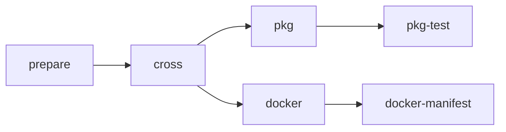

# NLnet Labs Rust Cargo Packaging **reusable** workflow

## User guide

In this documentation we'll show you how to invoke the NLnet Labs Rust Cargo Packaging **reusable** workflow (hereafter the "pkg workflow") from your own repository and how to create the supporting files needed.

**Contents:**
- [Known issues](#known-issues)
- [See also](#see-also)
- [Can I just run the pkg workflow?](#can-i-just-run-the-pkg-workflow)
- [What packages can the pkg workflow produce?](#what-packages-can-the-pkg-workflow-produce)
- [How can I run the created packages?](#how-can-i-run-the-created-packages)
- [How does it work?](#how-does-it-work)
- [How can I use it?](#how-can-i-use-it)
- [A simple example](#a-simple-example)
- [A useful example](#a-useful-example)
- [Pkg workflow version numbers and upgrades](#pkg-workflow-version-numbers-and-upgrades)
- [Your application version number](#your-application-version-number)
- [Creating specific package types](#creating-specific-package-types)

## Known issues

The pkg workflow was originally written for use only by NLnet Labs. As such not all behaviours are yet (fully) configurable. With time, sufficient interest and resource permitting these limitations can in principle be removed. For a list of open issues and ideas for improvement and to submit your own see https://github.com/NLnetLabs/.github/issues/.

## See also

- **The starter workflow:** If you already know how to use this workflow but just want to quickly add it to a new project you might find the [starter workflow](../starter_workflow.md) helpful.

- **The testing & template repository:** The https://github.com/NLnetLabs/.github-testing/ repository contains test data and workflow invocations for testing the pkg workflow and is also a GitHub template repository from which you can create your own repository with sample input files and workflow invocation to get started with the pkg workflow.

- **Examples of the workflow in use:** If you're looking for examples of how to invoke and configure the pkg workflow you might want to look at one or more of the following NLnet Labs projects that use the workflow: [krill](https://github.com/NLnetLabs/krill/blob/main/.github/workflows/pkg.yml), [krill-sync](https://github.com/NLnetLabs/krill-sync/blob/main/.github/workflows/pkg.yml), [routinator](https://github.com/NLnetLabs/routinator/blob/main/.github/workflows/pkg.yml) and [rtrtr](https://github.com/NLnetLabs/rtrtr/blob/main/.github/workflows/pkg.yml)

## Can I just run the pkg workflow?

No, it is not intended to be used standalone. To use it you must call it from your own GitHub Workflow. See the [official GitHub Actions documentation](https://docs.github.com/en/actions/using-workflows/reusing-workflows#calling-a-reusable-workflow) on calling reusable workflows for more information.

## What packages can the pkg workflow produce?

The pkg workflow is capable of producing Linux (DEB & RPM) packages and Docker images.

Produced DEB and RPM packages will be attached as artifacts to the caller workflow run. **Only GitHub users with `actions:read` permission** will be able to download the artifacts.

> The pkg workflow does **NOT** publish DEB and/or RPM packages anywhere. If you want your users to be able to download the produced DEB and/or RPM either directly or from a package repository using a tool like `apt` (for DEB) or `yum` (for RPM) you will need to upload the packages to the appropriate location yourself.

Produced Docker images will be published to [Docker Hub](https://hub.docker.com/). In order for this to work you must configure the destination Docker Hub organisation, repository, username and password/access token and ensure that the used credentials provide write access to the relevant Docker Hub repository.

At NLnet Labs we publish produced DEB and RPM packages at https://packages.nlnetlabs.nl/ via an internal process that downloads the workflow run artifacts and signs & uploads them to the correct location, and Docker images are published by the pkg workflow to the appropriate repository under the https://hub.docker.com/r/nlnetlabs/ Docker organisation.

## How can I run the created packages?

Linux packages should be installed using the appropriate package manager (e.g. `apt` for DEB packages and `yum` for RPM packages).

Docker images can be run using the [`docker run`](https://docs.docker.com/engine/reference/commandline/run/) command.

## How does it work?

The pkg workflow is a GitHub Actions "reusable workflow" because it [defines](https://github.com/NLnetLabs/.github/blob/main/.github/workflows/pkg-rust.yml#L130) the `workflow_call` trigger and the set of inputs that must be provided in order to call the workflow. For an explanation of GitHub reusable workflows see the [official GitHub Actions documentation](https://docs.github.com/en/actions/using-workflows/reusing-workflows) on reusable workflows.

Once called the workflow runs one or more jobs like so:



All of the jobs except `prepare` are matrix jobs, i.e. N instances of the job run in parallel where N is the number of relevant input matrix permutations.

Only the packaging types that you request (via the workflow call parameters) will actually be run, i.e. you can build only DEB packages, or only RPM and Docker, and cross-compile or not as needed.

- `prepare` - checks if the given inputs look roughly okay.
- [`cross`](./cross_compiling.md) - cross-compiles the Rust Cargo application per the provided rules (if any).
- [`pkg`](./os_packaging.md) - compiles (if not already cross-compiled) and packages the Rust Cargo application as a DEB or RPM package.
- [`pkg-test`](./os_packaging.md) - tests the produced DEB/RPM packages, both with some standard checks and optionally with application-specific checks provided by you.
- [`docker`](./docker_packaging.md) - builds and publishes one or more Docker images.
- [`docker-manifest`](./docker_packaging.md) - publishes a combined Docker Manifest that groups architecture specific variants of the same image under a single Docker tag.

## How can I use it?

1. Decide which package types you want to create.
2. Determine which inputs you need to provide to the pkg workflow.
3. Create the files in your repository that will be referenced by the inputs.
4. Call the pkg workflow from your own workflow with the chosen inputs.
5. Run your workflow.
6. Use the created packages:
   - DEB and RPM packages will be attached as artifacts to the workflow run.
   - Docker images will have been published to Docker Hub.

For the complete definition of the available inputs [consult the pkg workflow source code](https://github.com/NLnetLabs/.github/blob/main/.github/workflows/pkg-rust.yml#L131).

## A simple example

A simple, but not very useful, invocation of the pkg workflow would be a file such as `.github/workflows/my_pkg_workflow.yml` in your GitHub repository with the following content:

```yaml
on:
  push:

jobs:
  my_pkg_job:
    uses: NLnetLabs/.github/.github/workflows/pkg-rust.yml@v1
```

_**Note:** this will **NOT** actually build any packages as it doesn't indicate which types of package to build or provide the necessary supporting information!_

## A useful example

For a minimal useful example complete with step-by-step explanation of all the pieces see [this page](./minimal_useful_example.md).

## Pkg workflow version numbers and upgrades

When fixes and improvements are made to the pkg workflow your workflow will benefit from them automatically. This is because on release we update the `@v1` tag to  point to refer to the latest v1.x.y release.

If a backward incompatible change were to be released it would be released as `v2` and you would need to update the `uses` line in your workfow in order to benefit from the changes in the new breaking release.

## Your application version number

The pkg workflow differentiates between "release", "pre-release", "unstable" and "development" versions of your application.

For example, an `XXX-rc1` (a "pre-release" or "release candidate") version defined in `Cargo.toml` requires special treatment for O/S packages as it should be considered older than `XXX` but won't be unless the dash `-` is replaced by a tilda `~`. Contrary to that, version `XXX-dev` (a "development" version) should be considered NEWER than `XXX` so SHOULD have a dash rather than a tilda. Also, `Cargo.toml` cannot contain tilda characters in the version number string so we have to handle this ourselves.

Further, when publishing to Docker Hub one wouldn't necessarily want the latest and greatest `main` branch code to be published as the Docker tag `latest` as users will automatically be upgraded to that if they don't provide a version number and do `docker run` (on a machine that has no version of the image yet locally) or do `docker pull` (to fetch the latest). There can still be value in letting users run the bleeding edge version for testing purposes and doing the Docker packaging for them, so we publish Docker images built from a `main` branch as tag `unstable`.

These are just a couple of examples of special behaviour relating to version numbers.

_**Known issue:** [Inconsistent determination version number determination](https://github.com/NLnetLabs/.github/issues/43)_

_**Known issue:** [Version number 'v' prefixed should not be required](https://github.com/NLnetLabs/.github/issues/44)_

## Creating specific package types

To learn more about how to build a particular package type using the pkg workflow see:

- [Cross compiling](./cross_compiling.md)
- [Creating O/S packages](./os_packaging.md)
- [Creating Docker images](./docker_packaging.md)

