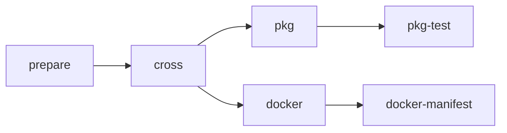

# NLnet Labs Rust Cargo Packaging **reusable** workflow

## User guide

In this documentation we'll show you how to invoke the NLnet Labs Rust Cargo Packaging **reusable** workflow (hereafter the "pkg workflow") from your own repository and how to create the supporting files needed.

## See also

**The starter workflow:**

If you already know how to use this workflow but just want to quickly add it to a new project you might find the [starter workflow](../starter_workflow.md) helpful.

**The testing & template repository:**

The https://github.com/NLnetLabs/.github-testing/ repository contains test data and workflow invocations for testing the pkg workflow and is also a GitHub template repository from which you can create your own repository with sample input files and workflow invocation to get started with the pkg workflow.

**Examples of the workflow in use:**

If you're looking for examples of how to invoke and configure the pkg workflow you might want to look at one or more of the following NLnet Labs projects that use the workflow: [krill](https://github.com/NLnetLabs/krill/blob/main/.github/workflows/pkg.yml), [krill-sync](https://github.com/NLnetLabs/krill-sync/blob/main/.github/workflows/pkg.yml), [routinator](https://github.com/NLnetLabs/routinator/blob/main/.github/workflows/pkg.yml) and [rtrtr](https://github.com/NLnetLabs/rtrtr/blob/main/.github/workflows/pkg.yml)

## Can I just run the pkg workflow?

No, it is not intended to be used standalone. To use it you must call it from your own GitHub Workflow. See the [official GitHub Actions documentation](https://docs.github.com/en/actions/using-workflows/reusing-workflows#calling-a-reusable-workflow) on calling reusable workflows for more information.

## What kinds of packages can be produced and what should I do with them?

The pkg workflow is capable of producing DEB, RPM packages and Docker images.

Produced DEB and RPM packages will be attached as artifacts to the caller workflow run. The pkg workflow does **NOT** publish DEB and/or RPM packages anywhere. If you want your users to be able to download the produced DEB and/or RPM either directly or from a package repository using a tool like `apt` (for DEB) or `yum` (for RPM) you will need to upload the packages to the appropriate location yourself.

Produced Docker images will be published to [Docker Hub](https://hub.docker.com/). In order for this to work you must configure the destination Docker Hub organisation, repository, username and password/access token and ensure that the used credentials provide write access to the relevant Docker Hub repository.

For example at NLnet Labs we publish produced DEB and RPM packages at https://packages.nlnetlabs.nl/ via an internal process that downloads the workflow run artifacts and signs & uploads them to the correct location, and Docker images are published by the pkg workflow to the appropriate repository under the https://hub.docker.com/r/nlnetlabs/ Docker organisation.

## How does it work?

The pkg workflow is a GitHub Actions "reusable workflow" because it [defines](https://github.com/NLnetLabs/.github/blob/main/.github/workflows/pkg-rust.yml#L130) the `workflow_call` trigger and the set of inputs that must be provided in order to call the workflow. For an explanation of GitHub reusable workflows see the [official GitHub Actions documentation](https://docs.github.com/en/actions/using-workflows/reusing-workflows) on reusable workflows.

Once called the workflow runs one or more jobs like so:

